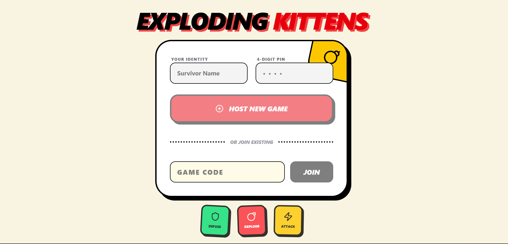
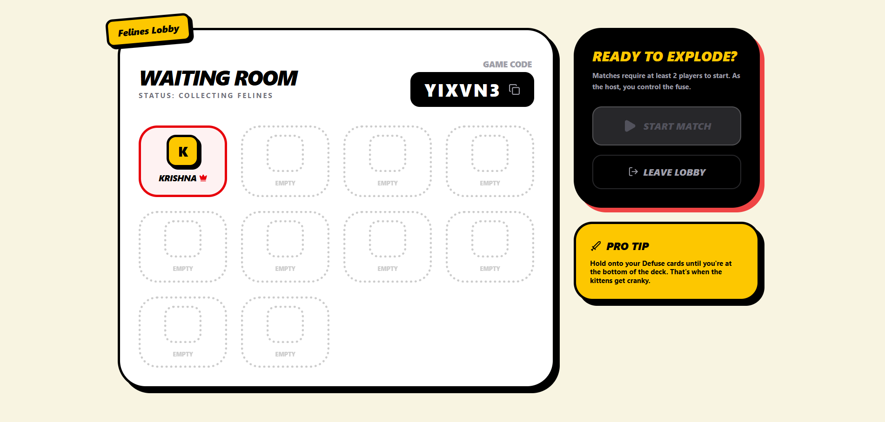
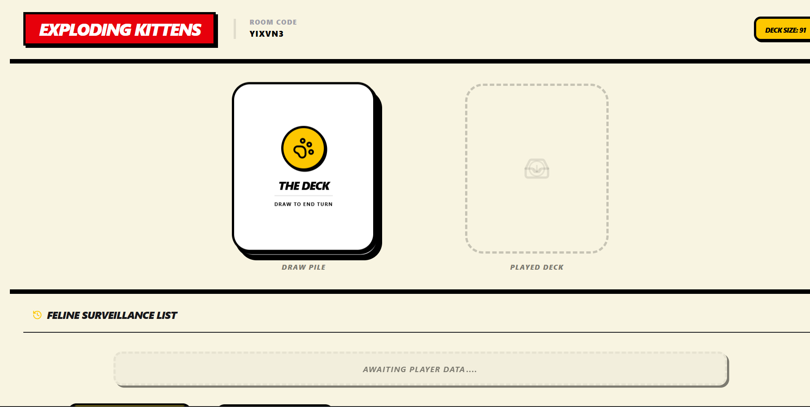
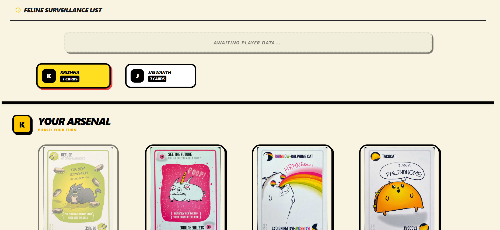

# Exploding Kittens

This is a real-time multiplayer implementation of **Exploding Kittens** developed using:

- **React + Vite + Tailwind** (Frontend)
- **Firebase Realtime Database** (Live game state)
- **Firebase Storage** (Static assets)
- **Firebase Hosting** (Deployment)

The system is designed around a room-based session model where each game instance is isolated under a unique `lobbyId`.

---

## UI Screenshots

Below are representative UI images of the application. All images are located inside the `resources/` directory.

### Landing Page

Users can create a new lobby or join an existing one using a room code.



---

### Lobby Page

Displays connected players, host controls, and game status before the match begins.



---

### Game Page (Gameplay View)

Main gameplay interface showing player hands, current turn indicator, deck interactions, and real-time state updates.




---

## System Design Overview

### Core Design Principle

Each game instance is stored under:

```
lobby/{lobbyId}
```

This isolates game state, allowing multiple games to run concurrently without interference.

The **Realtime Database** acts as the **single source of truth**. All players subscribe to their lobby node and respond to state changes.

---

## Realtime Database Schema

```json
{
  "cardImages": {
    "{cardName}": { "url": "imageUrl" }
  },
  "cards": {
    "{cardType}": [
      {
        "count": "number",
        "name": "string"
      }
    ]
  },
  "lobby": {
    "{lobbyId}": {
      "attackStack": 0,
      "cardsDeck": ["cardName1", "cardName2"],
      "cardsDeckBackup": ["cardName1", "cardName2"],
      "createdAt": 1771033588789,
      "currentPlayer": "playerName",
      "status": "WAITING | CANCELLED | IN GAME | FINISHED",
      "statusMessage": "",
      "players": {
        "{playerName}": {
          "deck": ["cardName1", "cardName2"],
          "host": true,
          "inGame": true,
          "joinedAt": 1771033589646,
          "pin": "1234"
        }
      },
      "usedCardsDetails": [
        {
          "playerName": "playerName",
          "selectedPlayerName": "selectedPlayerName",
          "cardName": "cardName1",
          "action": "Draw-Card | Play-Card | Steal-Card"
        }
      ],
      "notifyRequest": {
        "from": "fromPlayer",
        "to": "toPlayer",
        "cardType": "cardType",
        "requestType": "requestType",
        "shuffledCardNames": ["cardName2", "cardName1"]
      },
      "notifyRequestBackup": {
        "from": "fromPlayer",
        "to": "toPlayer",
        "cardType": "cardType",
        "requestType": "requestType",
        "shuffledCardNames": ["cardName2", "cardName1"]
      }
    }
  },
  "lobbyCodes": {
    "{ROOMCODE}": "{lobbyId}"
  }
}
```

---

## Model Explanation

### 1. `cardImages`

Maps each `cardName` to its Firebase Storage URL. This decouples UI from hardcoded asset paths.

### 2. `cards`

Stores master card distribution grouped by `cardType`. Used to initialize and shuffle `cardsDeck` at game start.

Each entry defines:

- `name`
- `count` (Different variations for each card type)

### 3. `lobby/{lobbyId}`

Represents a single running game.

#### Core Fields

- `attackStack`: Tracks stacked attack penalties.

- `cardsDeck`: Central draw pile (authoritative).

- `cardsDeckBackup`: Used to restore deck state during undo (Nope resolution).

- `currentPlayer`: Indicates whose turn it is.

- `status`: Lifecycle control
  - WAITING
  - CANCELLED
  - IN GAME
  - FINISHED

- `statusMessage`: Non-authoritative UI helper field displayed to all users when updated.

### 4. `players`

Each player node contains:

- `deck` - Player's hand
- `host` - Lobby owner
- `inGame` - Active status
- `joinedAt` - Timestamp
- `pin` - Player PIN

Player decks are stored separately to avoid rewriting entire lobby state.

---

### 5. `usedCardsDetails`

Maintained as a **stack**.

- Every action pushes a new entry to the top.
- Recent action is always the latest element.
- Designed to support undo and replay logic.

Actions tracked:

- `Draw-Card`
- `Play-Card`
- `Steal-Card`

This allows deterministic state tracing.

---

### 6. `notifyRequest`

This is a critical transaction field used during:

- Favor
- Two-of-a-kind Steal
- Three-of-a-kind Demand

Acts as a temporary handshake object between two players and renders the necessary UI components for the involved players.

Fields:

- `from`
- `to`
- `cardType`
- `requestType`
- `shuffledCardNames`

`shuffledCardNames` is used to randomize card selection for fairness and is used for Two-of-a-kind Steal.

When a steal interaction completes or is cancelled, this field is cleared or restored using `notifyRequestBackup`.

---

### 7. Backup Fields

These are used specifically for handling **Nope** interruptions. The Two backup fields are:

- `cardsDeckBackup`
- `notifyRequestBackup`

If a Nope invalidates a move:

- The previous state is restored from backup.
- This ensures deterministic rollback without recomputing state.

---

### 8. `lobbyCodes`

```
lobbyCodes/{ROOM_CODE} - lobbyId
```

Maps a public 6-digit room code to the internal Firebase `lobbyId`, acting as a lightweight proxy layer to avoid exposing Firebase-generated keys.

**Enables:** human-readable room codes, fast lobby lookup, and a clean user-join flow.

---

## Concurrency Strategy

Since this is a multiplayer system:

- The **deck (`cardsDeck`) is centralized** to prevent client-side manipulation.
- Critical updates (attack stack, draw operations) use Firebase transactions.
- Clients subscribe only to:
  - `lobby/{lobbyId}`
  - `players`
  - Their own deck

This ensures:

- Real-time synchronization
- Low latency updates
- Minimal race conditions

---

## Why Realtime Database?

Chosen over Firestore because:

- Faster live synchronization
- Lower overhead for deeply nested game state
- Better suited for rapidly changing small game objects

---

## Local Development

### 1. Setup Environment Variables

Create `.env` from `.env.example`:

```
VITE_FIREBASE_API_KEY=
VITE_FIREBASE_AUTH_DOMAIN=
VITE_FIREBASE_PROJECT_ID=
VITE_FIREBASE_STORAGE_BUCKET=
VITE_FIREBASE_MESSAGING_SENDER_ID=
VITE_FIREBASE_APP_ID=
VITE_FIREBASE_DATABASE_URL=
```

### 2. Install Dependencies

```
npm install
```

### 3. Start Development Server

```
npm run dev
```

---

# Deploy to Firebase Hosting

### 1. Install Firebase CLI

```
npm install -g firebase-tools
```

### 2. Login

```
firebase login
```

### 3. Initialize Hosting (first time only)

```
firebase init
```

Select:

- Hosting
- Use existing project
- Public directory: `dist`
- Single-page app: Yes
- Do not overwrite index.html

### 4. Deploy

```
npm run build
firebase deploy
```

---

# Design Strengths

- Isolated game sessions via `lobbyId`
- Centralized authoritative deck
- Clear separation of card metadata vs game state
- Deterministic undo via minimal backups
- Scalable for multiple concurrent lobbies
- Minimal serverless backend complexity
- Fully real-time without custom servers
